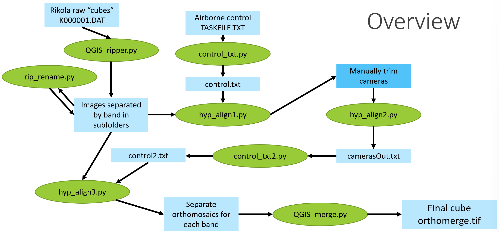
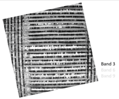
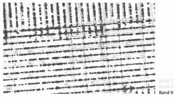
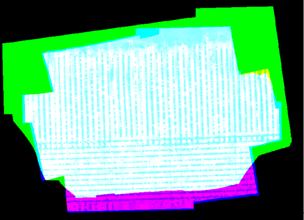

# rikola-hyperspec-align
Let this be evidence of the hell that was aligning the images from the Rikola hyperspectral imager.

## Overview
When I joined the [UF UAS Research Program](https://uas.ifas.ufl.edu/) in 2016 I was tasked with the problem of figuring out just how in the hell to use our Rikola hyperspectral imager. We were excited to have a hyperspectral frame sensor light enough to mount on a drone and eager to put it to use, but there was a little bit of an issue: the images of the different spectral bands were not taken simultaneously. So what is commonly referred to as the "data cube" in hyperspectral imaging--stacked images from the channels that cover the large number of spectral bands--was skewed in time. It was more of a...data parallelepiped. But slinkier. Imagine taking a deck of cards and pushing and twiting it around. That's how misaligned these images were within a "cube."

This Rikola imager was not designed to be used in motion and therefore there was no existing solution to bring together the unaligned frames of a "single" exposure station. So I, with practically no experience in Python at the time, set out to find the solution.

*It was not pretty, but it worked.*

What I present here is a series of scripts which interact with QGIS and Agisoft Photoscan (now called Metashape) to take these individual "data parallelepipeds" and separate them by channel, process separate orthomosaics for each channel, and merge the resulting orthomosaics into a final hyperspectral orthomosaic TIFF: a true data cube.

*A snippet of a flight line from a hyperspectral collection, top-down view. The blue rectangles show exposure stations, or locations of where the camera was when the image was taken. After separating the channels and solving for the camera locations for each channel group separately, we were able to quantify the misalignment of individual channel frames within each parallelepiped.*

*An example of three channels of a "data parallepiped" showing the misalignment from one channel to the other within the same Rikola output image.*

*Post-alignment.*

*A false RGB test image showing the final alignment of the separate orthomosaics.*

## The code

### QGIS_ripper.py

**INPUT:** Rikola raw “cubes” (e.g. K000001.DAT)

1. Set number of bands
2. Set directory containing Rikola raw data

**OUTPUT:** separate TIFF for each band at each camera station in subfolders (‘band1’, ’band2’, etc.)

### rip_rename.py

INPUT: separate TIFF for each band at each camera station

1. Set root directory containing subfolders

OUTPUT: renamed TIFFs to facilitate creation of Photoscan control file (i.e. removes timestamp from filename)

### control_txt.py

INPUT: TASKFILE.TXT from Rikola imager (contains airborne control)

1. Set path of TASKFILE.TXT
2. Set number of bands

OUTPUT: control.txt – airborne control in CSV format

### hyp_align1.py

INPUT: renamed TIFFs, control.txt

1. Set root directory containing subfolders
2. Set number of bands

USER INTERACTION: All cameras with control info loaded into single chunk; user manually trims cameras (e.g. takeoff and landing) to reduce processing time

### hyp_align2.py

1. Set root directory containing subfolders

OUTPUT: camerasOut.txt – camera pose estimations resulting from aligning images from all bands simultaneously

### control_txt2.py

INPUT: camerasOut.txt

1. Set directory containing camerasOut.txt (root)

OUTPUT: control2.txt – camera pose estimations from hyp_align2 in CSV format 

### hyp_align3.py

INPUT: renamed TIFFs, control2.txt

1. Set root directory containing subfolders
2. Set number of bands
3. Set output coordinate system (projected recommended)
4. 4et output resolution of orthomosaics

OUTPUT: Separate orthomosaics for each band (‘orthoband1.tif’ etc.)

### QGIS_merge.py

INPUT: Separate orthomosaics for each band (‘orthoband1.tif’ etc.)

1. Set path containing orthomosaics
2. Set number of bands

OUTPUT: final hypercube (GeoTIFF format)

## Funding

This work was supported by U.S. Geological Survey Research Work Order #300.

